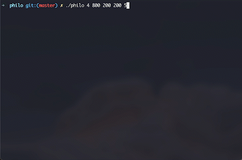
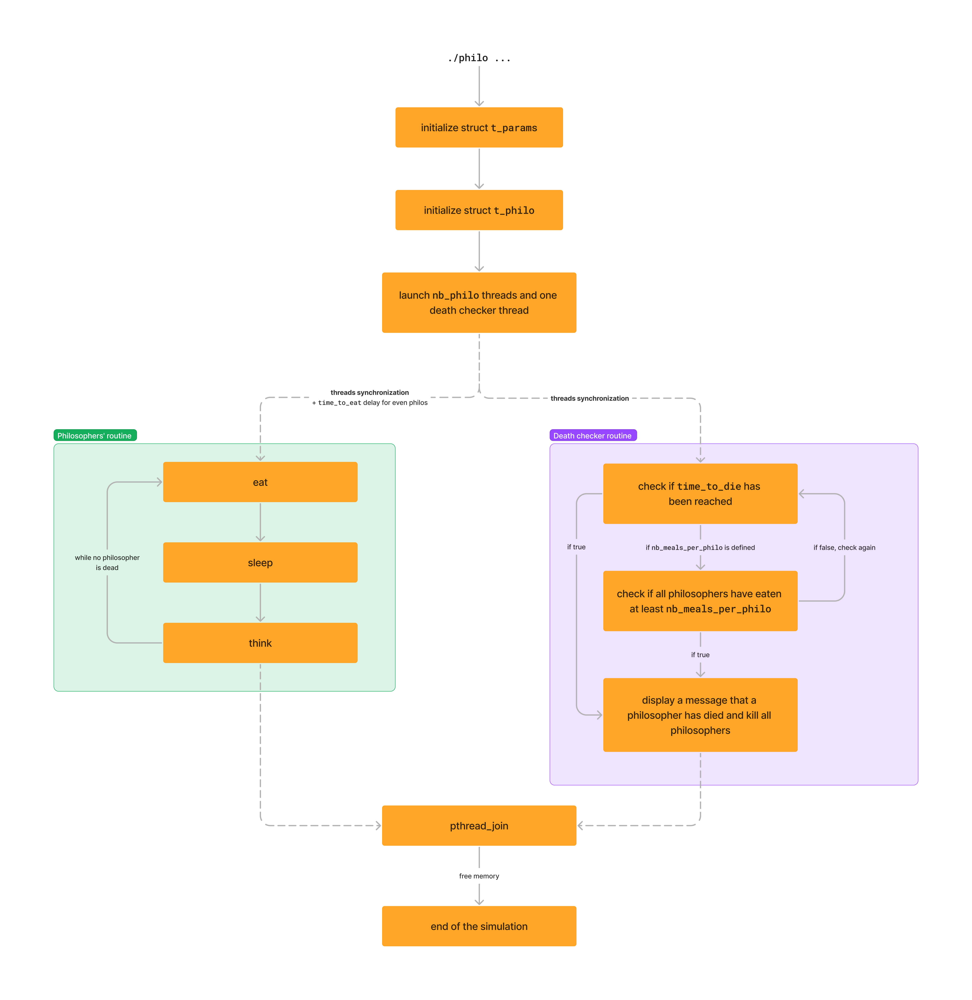

<div align="center">

# Philosophers
#### I never thought philosophy would be so deadly


</div>

[School's 42](https://42.fr/en/homepage/) project to find a solution to the [dining philosophers problem](https://en.wikipedia.org/wiki/Dining_philosophers_problem). This project is an introduction to concurrent programming, synchronization and shared memory issues.
<div align="center">


</div>

## Dining philosophers problem

This is a classic synchronization problem in computer science that involves multiple processes (philosophers) sharing a limited set of resources (forks) in order to perform a task (eating). In order to avoid deadlock or starvation, a solution must be implemented that ensures that each philosopher can access the resources they need to perform their task without interference from other philosophers.

## Subject

The subject constraints are as follows:
- there is at least one philosopher
- there are as many forks as philosophers
- philosophers have 3 states (eat, sleep and think)
- every philosopher needs to eat and should never starve.
- philosophers don’t speak with each other.
- philosophers don’t know if another philosopher is about to die
- philosophers should avoid dying
- logs should not be mixed up with another 
- a message announcing a philosopher died should be displayed no more than 10 ms after the actual death of the philosopher.

We need to log our program as follows: 
```bash
timestamp_in_ms X has taken a fork
timestamp_in_ms X is eating
timestamp_in_ms X is sleeping
timestamp_in_ms X is thinking
timestamp_in_ms X died
```

## Usage

| Parameters | meaning |
| ---------- | ------- | 
| `nb_philo` | the number of philosophers (and also the number of forks)
| `time_to_die` | (in ms) the time it takes for a philosopher to die after his last meal 
| `time_to_eat` | (in ms) the time it takes for a philosopher to eat. During that time, they will need to hold two forks.
| `time_to_sleep` | (in ms) the time a philosopher will spend sleeping
| `nb_meals_per_philo` | if all philosophers have eaten at least `nb_meals_per_philo`, the simulation stops

```bash
./philo nb_philo time_to_die time_to_eat time_to_sleep [nb_meals_per_philo]
```

## Solution

Here is a simplified diagram of how my program works.


We can split this program in three parts : 
- parsing
- thread synchronization and deadlock
- philosophers' routine
- death checker

### Parsing
I decided to create two structures. The first to store all parameters shared between philosophers (argv, forks, philo tab ...) and the second to store informations specific to each philosopher.

```c
typedef struct s_params
{
	int			nb_philos;
	int			time_to_die;
	int			time_to_eat;
	int			time_to_sleep;
	int			max_meal;
	unsigned long long	start_time;
	int			is_dead;
	pthread_mutex_t		is_dead_lock;
	t_philo			*philos;		
	pthread_t		death_checker;
	pthread_mutex_t		*forks;
	pthread_mutex_t		write_lock;
}	t_params;

typedef struct s_philo
{
	pthread_t		thread;				
	int			id;
	int			nb_meals;
	unsigned long long	last_meal_ts;
	pthread_mutex_t		last_meal_lock;
	int			left_fork;
	int			right_fork;
	struct s_params		*param;	
}	t_philo;
```

The program throw an error if `nb_philo` < 1 or other parameters are negatives or contain characters other than digits.

### Thread synchronization and deadlock
The part I had the most trouble with was this one. If we launch all threads at the same time, we have a deadlock situation. This causes starvation amons philosophers. For example, if we decided that to eat, philosophers take their left fork first and then their right fork, if all philosophers follows this order at the same time, then everyone will take their left fork and then no right fork will be available. We have deadlock. 
To avoid that, I decided to synchronize threads just after their launch then to shift the mealtime for philosophers with even id.

Thread synchronization is acheived by slightly increasing the value of the `start_time` variable in the `t_params`struct. So all threads start and then directly execute the `synchronize_threads()` function, enabling them all to start their routine at the same time.

```c
void	synchronize_threads(unsigned long long time)
{
	while (get_current_ts() < time)
		continue ;
}

static int	launch_threads(t_params *param)
{
	...
	// here is the shift of start_time
	param->start_time = get_current_ts() + (param->nb_philos * 10 * 2);
	...
}

void	*philo_routine(void *arg)
{
	...
	// Above all, thread synchronize
	synchronize_threads(philo->param->start_time);
	// Mealtime shifting for even id philosophers
	if (philo->id % 2 == 0)
		ft_sleep(philo->param, philo->param->time_to_eat);
	// Then routine is executed
	...
}
```

### Philosopher routine
Philo routine is quite simple. Above all, we synchronize threads and we check if there is only one philosopher in our simulation. If so, we launch a special routine:
```c
static void	*solo_philo_routine(void *arg)
{
	t_philo	*philo;

	philo = (t_philo *)arg;
	pthread_mutex_lock(&philo->param->forks[philo->right_fork]);
	print_action(philo, "has taken a fork");
	ft_sleep(philo->param, philo->param->time_to_die);
	print_action(philo, "died");
	pthread_mutex_unlock(&philo->param->forks[philo->right_fork]);
	return (NULL);
}
```
Otherwise, we lock left fork mutex then right fork mutex, sleep for `time_to_eat`, release forks' mutexes, sleep `time_to_sleep` and think. Philosophers  continue this loop as long as the variable `is_dead` is equal to 0.

### Death check routine
This routine is even simplier. Death checker is in a `while(1)` loop. First, it checks if a philosopher is dead (so `current_time - last_meal_time >= time_to_die`) then, if `max_meal`is defined, it checks if all philosophers have eaten at least `max_meal` time. 

## Useful links

[Wikipedia page of dining philosophers problem](https://en.wikipedia.org/wiki/Dining_philosophers_problem)  
[Philosophers visualizer](https://nafuka11.github.io/philosophers-visualizer/)  
[42-philosophers-tester](https://github.com/dantonik/42-philosophers-tester)  
[Course about concurrent programming](https://people.cs.pitt.edu/~aus/cs449/ts-lecture19.pdf)  
[Blog article about threads and mutexes in c](https://www.codequoi.com/en/threads-mutexes-and-concurrent-programming-in-c/)
